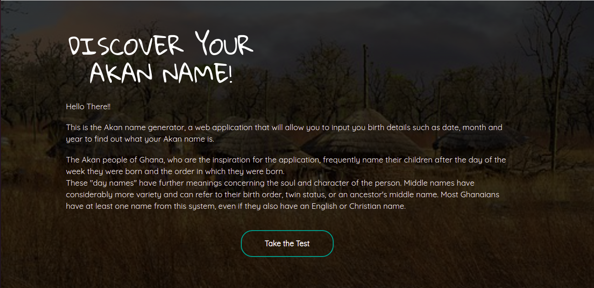
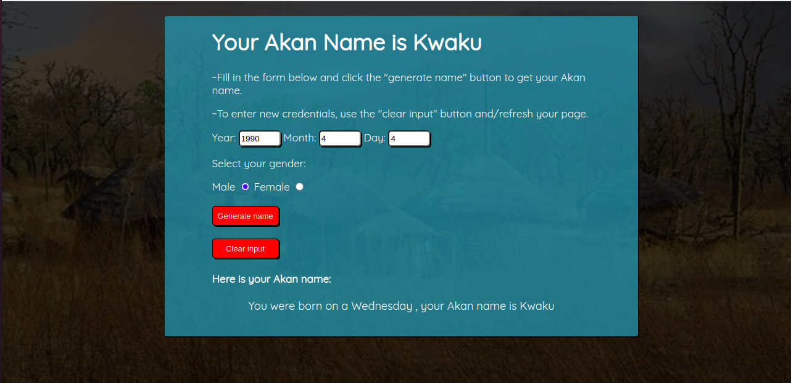

# About This Akan name generator

This project is based on [Javascript CSS HTML](#TechStack).

The Akan people of Ghana frequently name their children after the day of the week they were born and the order in which they were born. These "day names" have further meanings concerning the soul and character of the person.
This Web application will take in a user's year of birth, month of birth, day of birth and selected gender.It will then be possible to determine the exact day of the week the user was born and give them an Akan name based on their gender.

## Author
Kate Vanili, a full stack web developer based in Nairobi,Kenya.

# Table of Content

-   [Prerequisites](#Prerequisites)
-   [Setup Environment](#Technologies)
-   [Application features](#features)
-   [Contribute]

## Prerequisites

---

Make sure you have a browser with javascript enabled.

## Technologies

---
-   Javascript
-   CSS
-   HTML

### Setup Environment

1. Clone the repo : `git clone https://github.com/VaniliKate/week-two-projects.git`
2. Locate `index.html` from the file
3. Run `index.html` file in your favorite browser

## Application features

---
-   Input of year of birth.
-   Input month of birth.
-   Input day of birth.
-   Select Gender.
-   Output Akan name.
## Live site link
https://vanilikate.github.io/week-two-projects/

MIT License

Copyright (c) [2022] 

Permission is hereby granted, free of charge, to any person obtaining a copy
of this software and associated documentation files (the "Software"), to deal
in the Software without restriction, including without limitation the rights
to use, copy, modify, merge, publish, distribute, sublicense, and/or sell
copies of the Software, and to permit persons to whom the Software is
furnished to do so, subject to the following conditions:

The above copyright notice and this permission notice shall be included in all
copies or substantial portions of the Software.

THE SOFTWARE IS PROVIDED "AS IS", WITHOUT WARRANTY OF ANY KIND, EXPRESS OR
IMPLIED, INCLUDING BUT NOT LIMITED TO THE WARRANTIES OF MERCHANTABILITY,
FITNESS FOR A PARTICULAR PURPOSE AND NONINFRINGEMENT. IN NO EVENT SHALL THE
AUTHORS OR COPYRIGHT HOLDERS BE LIABLE FOR ANY CLAIM, DAMAGES OR OTHER
LIABILITY, WHETHER IN AN ACTION OF CONTRACT, TORT OR OTHERWISE, ARISING FROM,
OUT OF OR IN CONNECTION WITH THE SOFTWARE OR THE USE OR OTHER DEALINGS IN THE
SOFTWARE.

